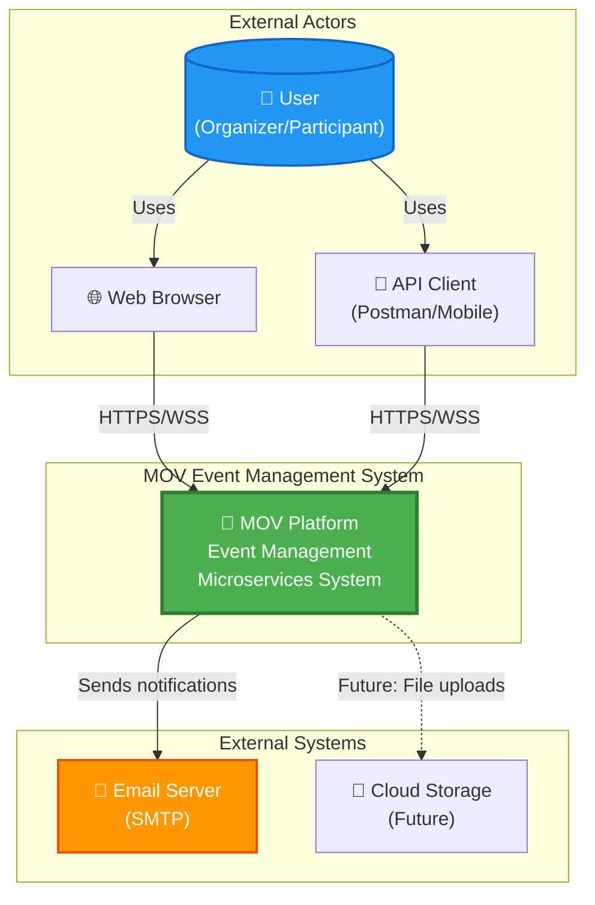
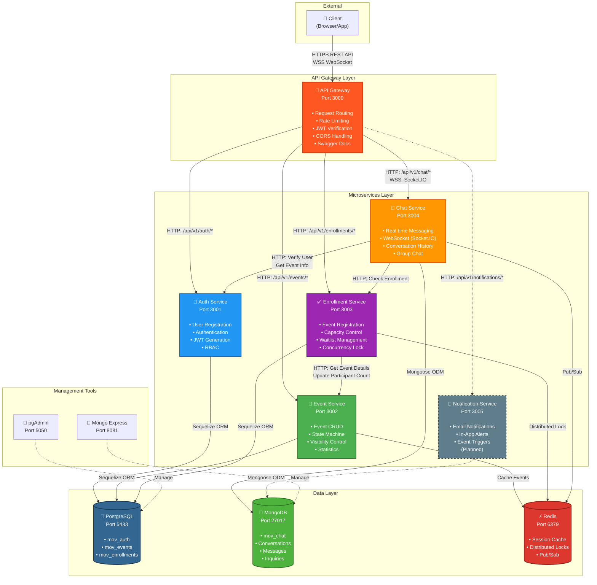
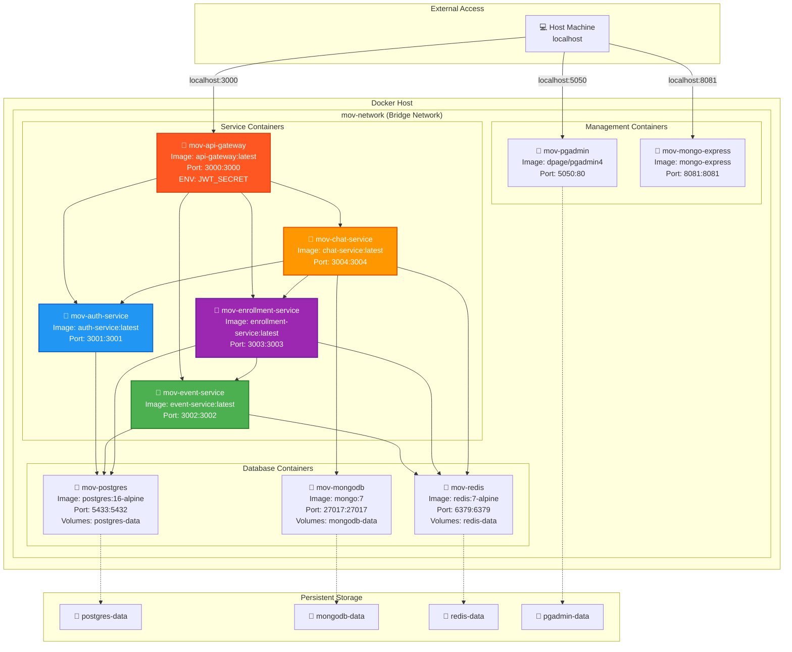
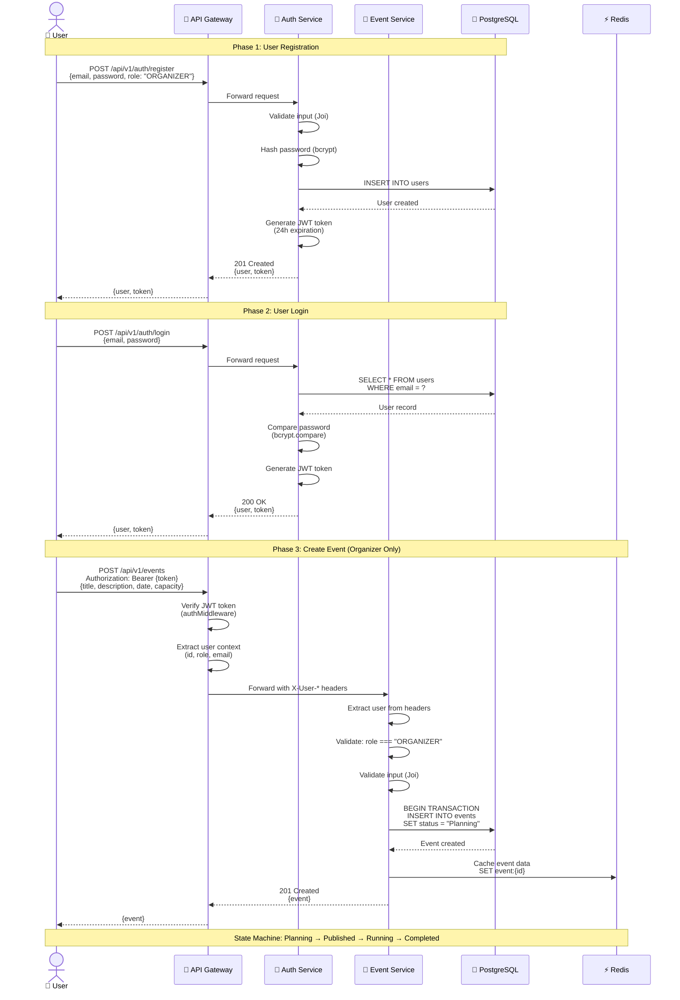
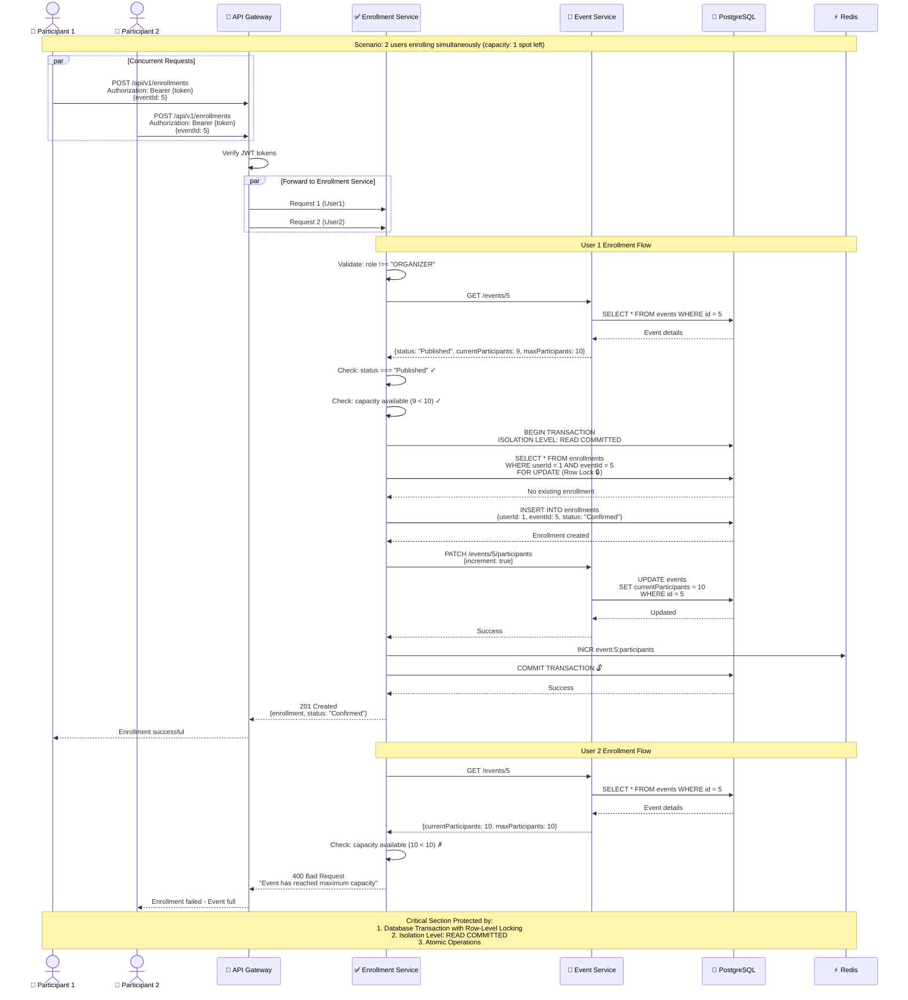
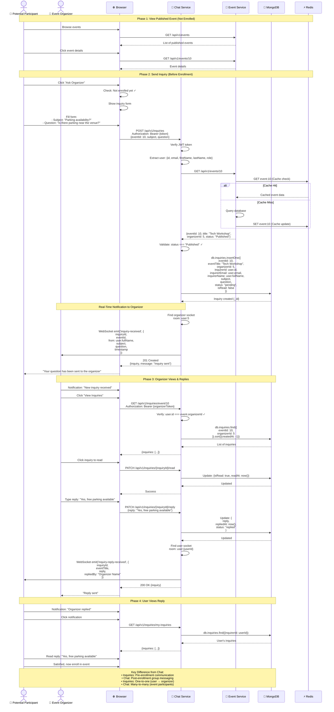
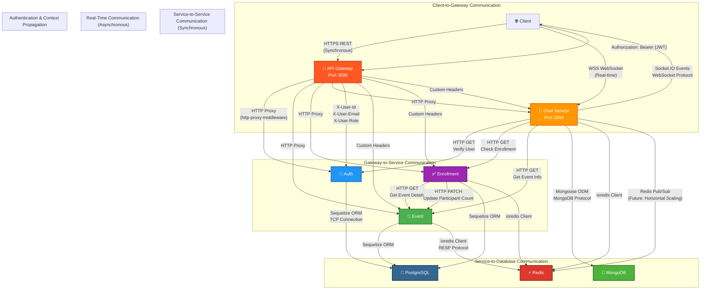
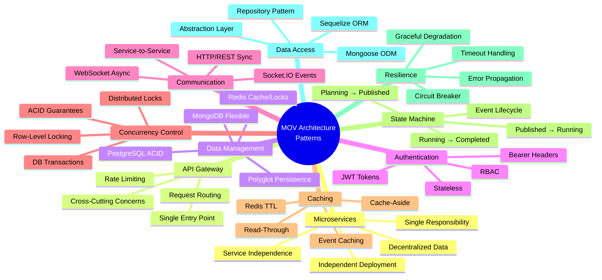

# UML Architecture Diagrams

This document contains comprehensive UML diagrams defining the architecture of the MOV Event Management System microservices application.

---

## Table of Contents

1. [System Context Diagram (C4 Level 1)](#1-system-context-diagram-c4-level-1)
2. [Container/Component Diagram (C4 Level 2)](#2-containercomponent-diagram-c4-level-2)
3. [Deployment Diagram](#3-deployment-diagram)
4. [Sequence Diagram - User Registration & Event Creation](#4-sequence-diagram---user-registration--event-creation)
5. [Sequence Diagram - Event Enrollment with Concurrency Control](#5-sequence-diagram---event-enrollment-with-concurrency-control)
6. [Sequence Diagram - Real-Time Chat Communication](#6-sequence-diagram---real-time-chat-communication)
7. [Sequence Diagram - Pre-Enrollment Inquiry System](#7-sequence-diagram---pre-enrollment-inquiry-system)
8. [Communication Patterns Diagram](#8-communication-patterns-diagram)
9. [Architecture Patterns Overview](#9-architecture-patterns-overview)

---

## 1. System Context Diagram (C4 Level 1)

**Purpose:** High-level overview showing the system and its external interactions.



**Key Points:**
- Single system boundary containing all microservices
- Users interact via web browsers or API clients
- System communicates with external email service
- HTTPS for REST APIs, WSS for WebSocket connections

---

## 2. Container/Component Diagram (C4 Level 2)

**Purpose:** Shows all services, databases, and their communication channels.



**Key Points:**
- **API Gateway Pattern**: Single entry point for all clients
- **Polyglot Persistence**: PostgreSQL for relational data, MongoDB for documents, Redis for caching
- **Service Communication**: HTTP for synchronous, WebSocket for real-time
- **Service-to-Service Calls**: Direct HTTP communication between services
- **Distributed Locking**: Redis ensures enrollment concurrency control

---

## 3. Deployment Diagram

**Purpose:** Shows the Docker containerization and network architecture.



**Deployment Details:**
- **Orchestration**: Docker Compose (`docker-compose.yml`)
- **Network**: Bridge network (`mov-network`) for inter-container communication
- **Health Checks**: All databases have health checks configured
- **Restart Policy**: `unless-stopped` for automatic recovery
- **Volume Persistence**: Data persists across container restarts
- **Port Mapping**: Internal container ports mapped to host ports

---

## 4. Sequence Diagram - User Registration & Event Creation

**Purpose:** Shows the authentication flow and event creation process.



**Key Patterns:**
- **JWT Authentication**: Stateless token-based auth
- **Password Security**: bcrypt hashing with salt rounds
- **Role-Based Access Control (RBAC)**: Only organizers can create events
- **Header-Based Context Propagation**: User context forwarded via headers
- **Input Validation**: Joi schemas validate all inputs
- **Caching Strategy**: Redis caches frequently accessed data

---

## 5. Sequence Diagram - Event Enrollment with Concurrency Control

**Purpose:** Demonstrates distributed locking and transaction handling for enrollment.



**Concurrency Control Mechanisms:**
1. **Row-Level Locking**: `SELECT ... FOR UPDATE` prevents race conditions
2. **Database Transactions**: ACID guarantees
3. **Isolation Level**: READ COMMITTED prevents dirty reads
4. **Atomic Operations**: Enrollment + participant count update in single transaction
5. **Redis Counter**: Optional fast check for capacity

---

## 6. Sequence Diagram - Real-Time Chat Communication

**Purpose:** Shows WebSocket communication for real-time messaging.

```mermaid
sequenceDiagram
    actor Organizer as 👤 Organizer
    actor Participant as 👤 Participant
    participant Browser as 🌐 Browser
    participant Gateway as 🚪 API Gateway
    participant Chat as 💬 Chat Service<br/>(Socket.IO)
    participant Mongo as 🍃 MongoDB
    participant Auth as 🔐 Auth Service
    participant Enroll as ✅ Enrollment Service
    
    Note over Organizer,Enroll: Phase 1: WebSocket Connection Setup
    
    Organizer->>Browser: Open event page
    Browser->>Chat: Connect WebSocket<br/>ws://localhost:3004<br/>auth: {token: "Bearer ..."}
    Chat->>Chat: Socket.IO handshake
    Chat->>Chat: Verify JWT token<br/>(socketAuth middleware)
    Chat->>Chat: Extract user from token<br/>{id, email, role}
    Chat-->>Browser: Connection accepted (socket.id)
    Chat->>Browser: Join room: user:{organizerId}
    
    Participant->>Browser: Open event page
    Browser->>Chat: Connect WebSocket<br/>auth: {token: "Bearer ..."}
    Chat->>Chat: Verify JWT token
    Chat-->>Browser: Connection accepted
    Chat->>Browser: Join room: user:{participantId}
    
    Note over Organizer,Enroll: Phase 2: Join Event Chat Room
    
    Participant->>Browser: Click "Join Event Chat"
    Browser->>Chat: emit('join-event-room', {eventId: 10})
    
    Chat->>Auth: HTTP GET /api/v1/auth/users/{participantId}
    Auth-->>Chat: User details
    
    Chat->>Enroll: HTTP GET /enrollments/check/10/{participantId}
    Enroll-->>Chat: {enrolled: true, status: "Confirmed"}
    
    Chat->>Chat: Verify access: enrolled ✓
    
    Chat->>Mongo: findOne({eventId: 10, type: "GROUP"})
    Mongo-->>Chat: Conversation found
    
    Chat->>Mongo: Update: Add participant to conversation
    Mongo-->>Chat: Updated
    
    Chat->>Browser: Join Socket.IO room: event:10
    Chat->>Browser: emit('joined-event-room', {conversationId, eventId})
    Chat->>Organizer: emit('user-joined', {userId, userName, role})
    
    Note over Organizer,Mongo: Phase 3: Real-Time Messaging
    
    Participant->>Browser: Type message
    Browser->>Chat: emit('send-message', {<br/>  conversationId,<br/>  content: "What time does the event start?"<br/>})
    
    Chat->>Mongo: db.messages.insertOne({<br/>  conversationId,<br/>  senderId,<br/>  content,<br/>  type: "TEXT",<br/>  timestamp<br/>})
    Mongo-->>Chat: Message saved {_id}
    
    Chat->>Mongo: Update conversation.lastMessage
    Mongo-->>Chat: Updated
    
    Chat->>Browser: emit('message-sent', {messageId})
    Chat->>Organizer: emit('new-message', {message})
    
    Note over Organizer,Mongo: Phase 4: Organizer Reply
    
    Organizer->>Browser: Type reply
    Browser->>Chat: emit('send-message', {<br/>  conversationId,<br/>  content: "Event starts at 2 PM"<br/>})
    
    Chat->>Mongo: Save message
    Mongo-->>Chat: Saved
    
    Chat->>Browser: emit('message-sent', {messageId})
    Chat->>Participant: emit('new-message', {message})
    
    Participant->>Browser: See message in real-time
    
    Note over Organizer,Mongo: Phase 5: Mark as Read
    
    Participant->>Browser: View message
    Browser->>Chat: emit('mark-as-read', {messageIds: [...]})
    Chat->>Mongo: Update: messages.isRead = true
    Mongo-->>Chat: Updated
    Chat->>Organizer: emit('messages-read', {messageIds, userId})
    
    Note over Organizer,Mongo: WebSocket Events:<br/>• send-message → new-message<br/>• join-event-room → user-joined<br/>• typing → user-typing<br/>• mark-as-read → messages-read
```

**WebSocket Communication Patterns:**
- **Bidirectional**: Client and server both emit events
- **Event-Driven**: Socket.IO event handlers
- **Room-Based**: Users join rooms (user rooms, event rooms)
- **Authentication**: JWT token validated on connection
- **Authorization**: Enrollment verified before joining event chat
- **Persistence**: Messages saved to MongoDB
- **Broadcasting**: Messages sent to all users in room

---

## 7. Sequence Diagram - Pre-Enrollment Inquiry System

**Purpose:** Shows the inquiry system for users to contact organizers before enrolling.



**Inquiry System Features:**
- **Pre-Enrollment Communication**: Ask questions before committing
- **REST + WebSocket**: Both APIs available
- **Real-Time Notifications**: Organizers notified instantly
- **Status Tracking**: pending → replied → closed
- **Read Receipts**: Track when organizer viewed inquiry
- **Separation from Chat**: Isolated from enrolled participant chat
- **Event State Validation**: Only for PUBLISHED events

---

## 8. Communication Patterns Diagram

**Purpose:** Shows all communication protocols and patterns used in the system.



**Communication Protocols:**

| Protocol | Use Case | Service Pairs | Purpose |
|----------|----------|---------------|---------|
| **HTTPS REST** | Client ↔ Gateway | Client → API Gateway | Synchronous API calls |
| **WSS (WebSocket)** | Real-time | Client ↔ Chat Service | Bidirectional messaging |
| **HTTP** | Service-to-Service | Enrollment → Event, Chat → Auth | Synchronous service calls |
| **TCP** | Database | Services → PostgreSQL | Persistent connections |
| **MongoDB Protocol** | Database | Chat → MongoDB | Document operations |
| **RESP** | Cache | Services → Redis | Cache & distributed locks |
| **Socket.IO** | Real-time | Chat ↔ Clients | Event-driven messaging |

**Context Propagation:**
- **JWT Token**: Client sends in `Authorization` header
- **Gateway Extracts**: User ID, email, role from token
- **Custom Headers**: `X-User-Id`, `X-User-Email`, `X-User-Role`
- **Services Read**: Extract user context from headers
- **Stateless**: No session storage needed

---

## 9. Architecture Patterns Overview

**Purpose:** Documents all architectural patterns used in the system.



### Pattern Details

#### 1. **Microservices Architecture**
- **Implementation**: 5 independent services (Auth, Event, Enrollment, Chat, Notification)
- **Benefits**: 
  - Independent scaling (scale Enrollment during peak registration)
  - Independent deployment (deploy Event service without affecting Chat)
  - Technology flexibility (Node.js for all, but can mix languages)
  - Team independence (separate teams per service)
- **Trade-offs**: Increased complexity, distributed system challenges

#### 2. **API Gateway Pattern**
- **Implementation**: Express.js with `http-proxy-middleware`
- **Responsibilities**:
  - Rate limiting (100 req/15min per IP)
  - CORS handling
  - JWT verification
  - Request routing
  - Swagger documentation hosting
- **Benefits**: Single entry point, centralized cross-cutting concerns

#### 3. **Database Per Service (Polyglot Persistence)**
- **PostgreSQL**: ACID transactions for Auth, Events, Enrollments
- **MongoDB**: Flexible schema for Chat messages, Conversations, Inquiries
- **Redis**: In-memory cache for events, distributed locks, pub/sub
- **Benefits**: Optimized database per use case, no single point of failure

#### 4. **JWT Token-Based Authentication**
- **Implementation**: `jsonwebtoken` library, 24-hour expiration
- **Flow**: Login → Receive token → Include in Authorization header
- **Benefits**: Stateless, scalable, no server-side session storage
- **Security**: bcrypt password hashing (10 salt rounds), HTTPS only

#### 5. **Communication Patterns**
- **Synchronous (HTTP/REST)**: Client ↔ Gateway, Service ↔ Service
- **Asynchronous (WebSocket)**: Real-time chat, notifications
- **Event-Driven**: Socket.IO events (send-message, join-room, typing)
- **Request/Response**: REST APIs for CRUD operations

#### 6. **Concurrency Control**
- **Row-Level Locking**: `SELECT ... FOR UPDATE` prevents double enrollment
- **Database Transactions**: ACID guarantees for enrollment + participant count update
- **Isolation Level**: READ COMMITTED prevents dirty reads
- **Distributed Lock**: Redis for cross-service synchronization (future)

#### 7. **Caching Strategy (Cache-Aside)**
- **Pattern**: Check cache → If miss, query DB → Update cache
- **Implementation**: Redis with TTL expiration
- **Cached Data**: Event details, user profiles (future)
- **Invalidation**: Update/delete triggers cache eviction

#### 8. **State Machine Pattern (Event Lifecycle)**
- **States**: Planning → Published → Running → Completed → Canceled
- **Transitions**: Enforced by validation logic
- **Rules**:
  - Only PUBLISHED events allow enrollment
  - Only ORGANIZER can change status
  - Cannot revert from COMPLETED to RUNNING
- **Implementation**: `status` field in Event model

#### 9. **Circuit Breaker (Implicit)**
- **Timeout Handling**: HTTP requests timeout after 30 seconds
- **Graceful Degradation**: Service failures don't cascade (enrollment success even if count update fails)
- **Error Propagation**: Service errors wrapped in consistent error format
- **Retry Logic**: Axios retry for transient failures (future)

#### 10. **Repository Pattern (ORM/ODM)**
- **Sequelize (PostgreSQL)**: Models define schema, migrations manage changes
- **Mongoose (MongoDB)**: Schemas with validation, middleware hooks
- **Benefits**: Data access abstraction, business logic separation
- **Models**: User, Event, Enrollment, Conversation, Message, Inquiry

---

## External API Access Summary

### Public APIs (No Authentication)
- `GET /api/v1/events` - View published events
- `GET /api/v1/events/{id}` - View event details
- `POST /api/v1/auth/register` - User registration
- `POST /api/v1/auth/login` - User login

### Authenticated APIs (JWT Required)
- `GET /api/v1/auth/me` - Get profile
- `POST /api/v1/events` - Create event (ORGANIZER only)
- `POST /api/v1/enrollments` - Enroll in event (PARTICIPANT only)
- `GET /api/v1/chat/conversations` - Get conversations
- WebSocket connection to `ws://localhost:3004` for real-time chat

### Service-to-Service APIs (Internal)
- `GET /api/v1/auth/users/{id}` - Get user by ID
- `PATCH /api/v1/events/{id}/participants` - Update participant count
- `GET /api/v1/enrollments/check/{eventId}/{userId}` - Check enrollment status

### Management Tools
- **Swagger UI**: `http://localhost:3000/api-docs` - API documentation
- **pgAdmin**: `http://localhost:5050` - PostgreSQL management
- **Mongo Express**: `http://localhost:8081` - MongoDB management

---

## Summary

This document provides comprehensive UML diagrams defining the MOV Event Management System architecture:

1. **System Context**: High-level system boundaries and external actors
2. **Container Diagram**: All microservices, databases, and communication channels
3. **Deployment**: Docker containerization and network architecture
4. **Sequence Diagrams**: Key user flows with detailed interactions
5. **Communication Patterns**: All protocols and data flow patterns
6. **Architecture Patterns**: Design patterns implemented throughout

**Key Architectural Characteristics:**
- ✅ **Microservices Architecture** with 5 independent services
- ✅ **API Gateway Pattern** for single entry point and routing
- ✅ **Polyglot Persistence** (PostgreSQL, MongoDB, Redis)
- ✅ **JWT Authentication** for stateless auth
- ✅ **WebSocket (Socket.IO)** for real-time communication
- ✅ **Docker Compose** for orchestration
- ✅ **Concurrency Control** via database transactions and locks
- ✅ **State Machine** for event lifecycle management
- ✅ **Cache-Aside Pattern** for performance optimization
- ✅ **Repository Pattern** with ORM/ODM abstraction

**Communication Channels:**
- HTTP/HTTPS for REST APIs (synchronous)
- WebSocket (Socket.IO) for real-time chat (asynchronous)
- Custom headers for user context propagation
- Service-to-service HTTP calls for data coordination

**Patterns Used:**
- Microservices, API Gateway, Database per Service
- JWT Token-Based Auth, RBAC
- Row-Level Locking, Distributed Transactions
- Cache-Aside, State Machine
- Repository, Circuit Breaker (implicit)

---

*Generated: January 25, 2026*  
*Project: MOV Event Management System*  
*Architecture: Microservices with Docker Compose*
